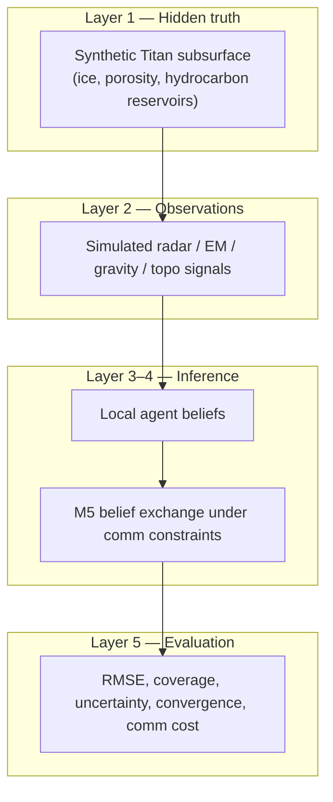

# ExploreTitan — Data Sources & Input Concept

Reference catalog for datasets and data roles supporting the **Distributed Hydrogeophysical Inference for Titan Subsurface Exploration** simulation framework. See also [`PROJECT_BASE.md`](PROJECT_BASE.md).

---

## Concept Clarification

ExploreTitan is **not** a mission-operations or drone-navigation project. It is a **computational inference experiment**:

> Given incomplete, spatially scattered geophysical observations, can a **network of local agents** reconstruct a hidden subsurface world as well as—or better than—a **centralized inversion pipeline**?

### Three stacked problems



### Critical distinction

There is **no public database of Titan's true subsurface**. Cassini provides surface/near-surface and bulk-interior constraints, not borehole-style ground truth. Inputs therefore fall into **four roles**:

| Role | What it is | Source type |
|------|------------|-------------|
| **A. Ground truth** | Known subsurface state for simulation | Mostly **generated** (`TitanGrid`) |
| **B. Physics parameters** | Dielectric, density, phase behavior | **Material property databases** |
| **C. Observation priors** | Realistic signal patterns, noise, coverage | **Cassini PDS products** |
| **D. Method benchmarks** | Inversion / distributed-inference baselines | **Earth AEM + gravity archives** |

Real Titan data does **not** replace synthetic ground truth; it **constrains** how synthetic worlds are generated and how observations are simulated.

---

## Input Databases by Layer

### Layer 1 — Environment generation (synthetic worlds)

**Primary approach:** Generate `TitanGrid` locally with fields: `depth`, `porosity`, `hydrocarbon_fraction`, `dielectric_constant`.

#### Parameterize from

| Database | What it provides | Use in ExploreTitan |
|----------|------------------|---------------------|
| [Titan Material Property Database (UCSC)](https://titanmaterials.sites.ucsc.edu/) | Densities, phase behavior, thermodynamics for 18 organics + tholins | Realistic ranges for ice, liquid hydrocarbon, haze materials |
| [Material Properties of Organic Liquids, Ices, and Hazes on Titan (ApJS)](https://iopscience.iop.org/article/10.3847/1538-4365/acc6cf) | Peer-reviewed compilation backing the UCSC database | Citation-backed parameter bounds |
| [Microwave dielectric constants of Titan-relevant materials](https://agupubs.onlinelibrary.wiley.com/doi/10.1029/2008GL035216) | Lab dielectric values at ~94 K (methane, tholins, water–ammonia ice) | Forward-model dielectric/radar response |

#### Spatial / template constraints from real Titan

| Database | What it provides | Use |
|----------|------------------|-----|
| [Cassini RADAR Digital Map Products (Cornell)](https://data.astro.cornell.edu/RADAR/) | Global gridded backscatter, topo-related maps (~9% direct coverage) | Surface morphology templates, lake regions, dune vs. bright terrain |
| [Cassini SAR-derived DTM (Cornell eCommons)](https://ecommons.cornell.edu/items/88de3ac0-b77b-46fa-bb30-ba02f17cf12c) | Interpolated topography from altimetry + SARtopo + stereo | Surface boundary conditions for subsurface models |

---

### Layer 2 — Forward physics / simulated observations

**Simulated channels:** radar backscatter, EM attenuation, dielectric response, gravity anomalies, topography.

#### Real observation archives (calibrate simulators)

| Database | Modalities | Access |
|----------|------------|--------|
| [Cassini RADAR PDS volumes](https://pds-imaging.jpl.nasa.gov/volumes/radar.html) | SAR (BIDR), altimetry (ABDR/ASUM), radiometry/scatterometry (SBDR/LBDR) | [PDS Imaging Node — Cassini](https://pds-imaging.jpl.nasa.gov/portal/cassini_mission.html) |
| [PDS RADAR Imaging Atlas](https://pds-imaging.jpl.nasa.gov/search/?fq=ATLAS_MISSION_NAME:cassini&fq=ATLAS_INSTRUMENT_NAME:radar&q=*:*) | Searchable flyby-level products | Query by target, geometry, date |
| [RADAR User's Guide (PDS PDF)](https://pds-imaging.jpl.nasa.gov/documentation/RADARUsersGuide2ndEdV2.pdf) | Mode specs, bandwidth, resolution, product definitions | Noise and resolution priors for simulation |
| [Cassini VIMS volumes](https://pds-imaging.jpl.nasa.gov/volumes/vims.html) | IR surface composition, morphology context | Secondary surface-property channel |
| [PGDA — Titan gravity & interior models](https://pgda.gsfc.nasa.gov/products/91) | Spherical harmonic coefficients, Love number k2, MCMC interior samples | Bulk gravity constraints; subsurface ocean inference context |
| [Titan gravity after Cassini (Iess et al., 2019)](https://ui.adsabs.harvard.edu/abs/2019Icar..326..123D) | Updated k2 ≈ 0.62, degree-5 field, compensation behavior | Gravity channel calibration; uncertainty framing |

#### Gravity methodology archives (algorithm design, not Titan ground truth)

Relevant to distributed vs. centralized field recovery (e.g., Watkins / GRACE–GRAIL lineage):

| Database | Relevance |
|----------|-----------|
| [PGDA home](https://pgda.gsfc.nasa.gov/) | Planetary geodesy products hub |
| [GRAIL GRGM1200A (PGDA / PDS)](https://pgda.gsfc.nasa.gov/products/50) | High-degree lunar gravity; clone ensembles for uncertainty |
| [GRACE-FO L2 spherical harmonics (PO.DAAC)](https://podaac.jpl.nasa.gov/dataset/GRACEFO_L2_JPL_MONTHLY_0063) | Time-variable gravity processing patterns |

These archives illustrate how sparse tracking data becomes a recovered field—directly relevant to centralized vs. distributed reconstruction comparisons.

---

### Layer 3–4 — Inference architecture (Earth hydrogeophysics analogs)

Rosemary Knight's domain is **infer hidden structure from EM measurements**. These Earth datasets are the best open analogs for inversion benchmarking:

| Database | Size / type | Use in ExploreTitan |
|----------|-------------|---------------------|
| [DL-RMD (Zenodo)](https://doi.org/10.5281/zenodo.7260886) | ~1M 1-D resistivity models + EM responses (S/I/D variants) | Forward/inversion benchmark; surrogate training; centralized baseline behavior |
| [DL-RMD code (GitHub)](https://github.com/rizwanasif/DL-RMD) | Demo forward passes | Pipeline reference |
| [tTEM20AAR (Zenodo)](https://doi.org/10.5281/zenodo.4269887) | Field TDEM + inverted resistivity, 1500 ha, 20 m spacing | Realistic spatial heterogeneity patterns |
| [Kaweah Subbasin AEM (Stanford Data Repository)](https://purl.stanford.edu/yc041mz9691) | Processed SkyTEM AEM, groundwater imaging context | Field-scale AEM workflow analog to Knight-style inference |

#### Broader geophysics catalogs (optional)

| Resource | Notes |
|----------|-------|
| [SEG Open Data Wiki](https://wiki.seg.org/wiki/Open_data) | Seismic/subsurface synthetic sets (SEAM, etc.) — less direct for Titan EM but useful for inversion benchmarking culture |
| [SEAM Phase I models](https://wiki.seg.org/wiki/Open_data) | Large synthetic seismic subsurface models |

---

### Layer 5 — Evaluation & validation

| Input | Purpose |
|-------|---------|
| Synthetic `true_subsurface` vs. `predicted_subsurface` | RMSE (primary — no Titan subsurface truth exists publicly) |
| Cassini surface products (above) | Qualitative realism checks on reconstructed surface expressions |
| PGDA Titan gravity solutions | Compare bulk anomaly patterns, not pixel-level subsurface truth |
| GRAIL clone gravity ensembles | Template for reporting spatial uncertainty fields |

---

## What "Inputted" Means in Practice

### Phase 1 (recommended start)

```
INPUTS YOU ACTUALLY LOAD
├── Physics params     → Titan Materials DB + dielectric literature
├── Surface templates  → Cornell RADAR DMP / DTM (optional: poles, lakes)
├── Sim config         → Generated TitanGrid CSVs (environment_001, ...)
└── Benchmarks         → DL-RMD subset for inversion sanity checks

INPUTS YOU DO NOT NEED YET
├── Full Cassini PDS archive (TB-scale; query subsets only)
├── Operational drone telemetry
└── Real Titan subsurface labels (they do not exist publicly)
```

### Phase 2 (validation against real data)

- Pull **targeted** Cassini RADAR flybys (e.g., polar lakes, T110-adjacent geometry) via the [PDS Imaging Atlas](https://pds-imaging.jpl.nasa.gov/search/?fq=ATLAS_MISSION_NAME:cassini&fq=ATLAS_INSTRUMENT_NAME:radar&q=*:*).
- Use PGDA Titan gravity as a **bulk constraint**, not inversion labels.
- Compare distributed vs. centralized recovery of **the same synthetic truth** under Cassini-like sparsity masks.

---

## Conceptual Mapping (one line per data family)

| Data family | Role in ExploreTitan |
|-------------|---------------------|
| **Titan materials DB** | Defines physically plausible subsurface worlds |
| **Cassini RADAR / VIMS** | Defines realistic observation patterns and coverage sparsity |
| **PGDA Titan gravity** | Constrains large-scale mass distribution and interior hypotheses |
| **DL-RMD / tTEM / Kaweah AEM** | Benchmarks EM-style inversion before porting logic to Titan agents |
| **GRACE / GRAIL archives** | Benchmarks sparse orbital measurement → global field recovery |
| **Generated TitanGrid** | Sole source of true subsurface labels for quantitative RMSE |

---

## Strategic Positioning

| Element | Role |
|---------|------|
| **Primary innovation** | Distributed geophysical inference framework |
| **Platform** | Autonomous agents (simulated) |
| **Planetary case** | Titan |
| **Scientific claim** | Reproducible simulation under Titan-like constraints — not operational drone design |

**Disciplinary ordering:** planetary subsurface characterization → geophysical imaging → distributed sensing

---

## Proposed `data/` Folder Contract

| Path | Source | Role |
|------|--------|------|
| `data/materials/titan_materials.csv` | UCSC DB export | Physics bounds |
| `data/templates/lake_region_topo/` | Cornell DTM subset | Surface template |
| `data/environments/environment_001.csv` | Generated | Ground truth |
| `data/observations/sim_run_001/` | Forward model output | Agent inputs |
| `data/benchmarks/dl_rmd_sample/` | Zenodo subset | Inversion baseline |
| `data/references/pgda_titan_gravity.sha` | PGDA | Bulk validation |

---

## Related Documentation

| File | Purpose |
|------|---------|
| [`PROJECT_BASE.md`](PROJECT_BASE.md) | Formal scientific project base |
| [`ExploreTitan Experiment.md`](ExploreTitan%20Experiment.md) | Experiment abstract |
| [`Explore Titan Research.md`](Explore%20Titan%20Research.md) | Research framing and architecture |
| [`AUDIO_EXTRACTION_PROMPT.md`](AUDIO_EXTRACTION_PROMPT.md) | Seminar audio extraction (e.g., Watkins / GRACE–GRAIL) |
| [`M5_Inference/MODIFICATION_DESIGN.md`](M5_Inference/MODIFICATION_DESIGN.md) | Notebook modification implementation spec |
| [`M5_Inference/CASSINI_IMAGING_GUIDE.md`](M5_Inference/CASSINI_IMAGING_GUIDE.md) | PDS Atlas search, download, and local template paths |

---

*Compiled for the [XTitan](https://github.com/nebularesearchlab-commits/XTitan) repository.*
