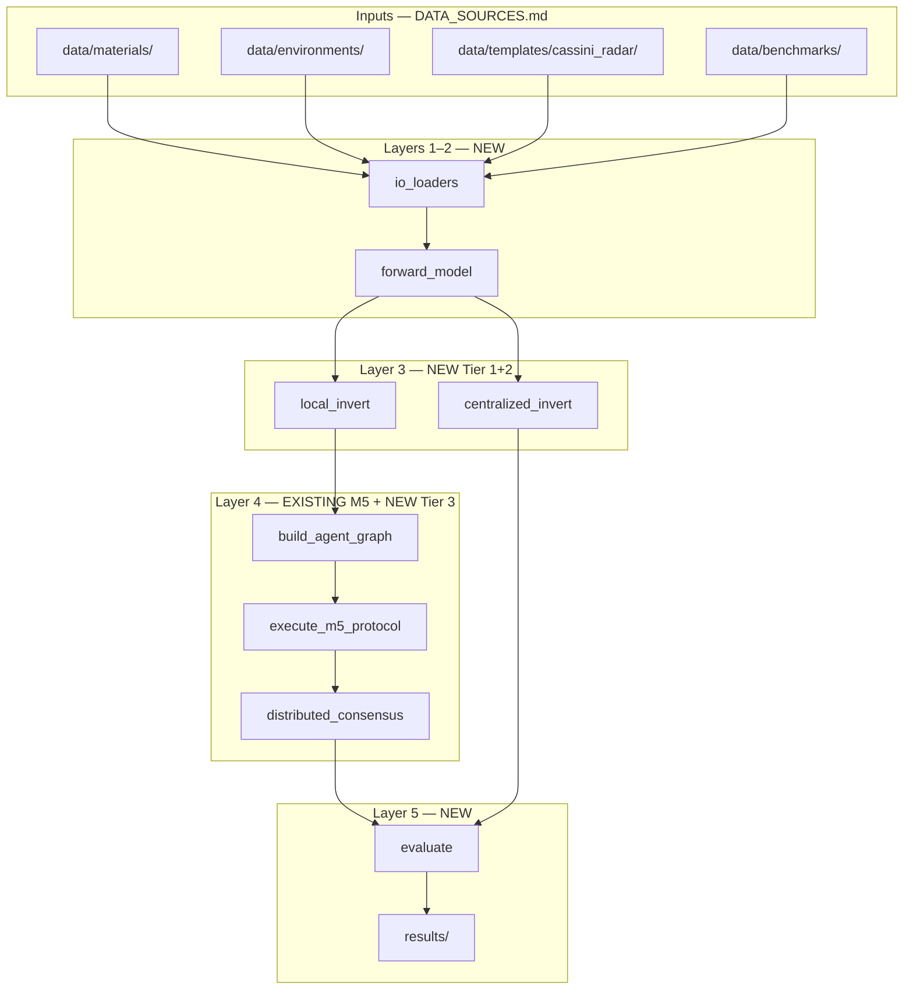

# M5_Inference — Modification Design Document

**Purpose:** Specify exactly what will be changed in `[Base]Module5_Protocol_Simulation.ipynb` and the surrounding `M5_Inference/` tree to transform the CAS 521 network protocol into the **ExploreTitan distributed hydrogeophysical inference experiment engine**.

**Status:** Staging / approved for implementation  
**Inputs contract:** [`../DATA_SOURCES.md`](../DATA_SOURCES.md)  
**Algorithm baseline:** [`MODULE5_ALGORITHMIC_DESIGN.md`](MODULE5_ALGORITHMIC_DESIGN.md)  
**Science base:** [`PROJECT_BASE.md`](PROJECT_BASE.md)  
**Imaging acquisition:** [`CASSINI_IMAGING_GUIDE.md`](CASSINI_IMAGING_GUIDE.md)
---

## 1. Design intent

### What we keep

The existing M5 three-stage protocol remains the **communication-topology layer** (Layer 4):

| Existing function | Retained role |
|-------------------|---------------|
| `execute_stage1` | Identify critical agents and must-preserve comm links |
| `execute_stage2` | Compress agent graph under bandwidth constraints |
| `execute_stage3` | Measure whether compressed topology preserves inference viability |
| `run_percolation_test` | Experiment 04 — network failure during inference |
| `execute_m5_protocol` | Orchestrator for comm topology (not subsurface inversion) |

### What we add

| New module | Tier | Layer | Role |
|------------|------|-------|------|
| Data loaders | — | I/O | Load `DATA_SOURCES.md` schemas |
| `environment.py` logic | — | 1 | Synthetic Titan ground truth |
| `forward_model.py` logic | Tier 2 | 2 | Simulate radar / EM observations |
| `inversion.py` logic | Tier 1 | 3 | Local + centralized posterior / MAP |
| `distributed_fusion.py` logic | Tier 3 | 4 | SCI / weighted consensus on beliefs |
| `evaluation.py` logic | — | 5 | RMSE, coverage, uncertainty, comm cost, convergence |

### What we deprecate (not delete)

Legacy CAS 521 paths gated behind `mode='legacy_network'`:

- `load_snap_graph`, `load_facebook_graph`
- cit-HepPh / Facebook / roadNet-CA as primary experiments
- Graph-only metrics as sole success criterion

Primary mode: `mode='exploretitan'`.

---

## 2. Target pipeline



### Top-level orchestrator (new)

```python
def run_exploretitan_experiment(config: ExperimentConfig) -> ExperimentResult:
    """
    End-to-end ExploreTitan run.
    Replaces cit-HepPh baseline as primary experiment entry point.
    """
    truth = load_environment(config.env_path)
    materials = load_materials(config.materials_path)
    obs = forward_model(truth, materials, config.noise, config.sparsity_mask)

    centralized = centralized_invert(obs, config)          # Exp 01 baseline
    local_beliefs = local_invert_all(obs, config)          # Layer 3

    G = build_agent_graph(truth, comm_radius=config.comm_radius)
    m5 = execute_m5_protocol(G, preserve_top_k=config.preserve_top_k)

    if config.mode == "distributed_full":
        predicted = distributed_consensus(local_beliefs, m5, config)   # Exp 02
    elif config.mode == "distributed_constrained":
        predicted = selective_consensus(local_beliefs, m5, config)     # Exp 03
    elif config.mode == "network_failure":
        predicted = failure_consensus(local_beliefs, m5, config)       # Exp 04

    return evaluate(truth, predicted, centralized, m5, config)
```

---

## 3. Notebook cell-block modification map

| Block | Current content | Modification | Deliverable |
|-------|-----------------|--------------|-------------|
| **0** | Setup (NetworkX, Louvain) | Add `scipy.optimize`, `pathlib`; optional `mode` flag | Extended imports cell |
| **1** | SNAP / Facebook loaders | **Replace primary path** with `load_titan_environment`, `load_materials`, `load_sparsity_mask` | Cell Block 1: ExploreTitan I/O |
| **2** | — | **New:** `generate_environment`, `forward_model` stub | Cell Block 2: Layer 1–2 |
| **3** | — | **New:** `local_invert`, `centralized_invert` (MAP + Laplacian prior) | Cell Block 3: Tier 1 |
| **4** | — | **New:** `build_agent_graph` from grid | Cell Block 4: Agent topology |
| **5** | Stage 1–3 M5 protocol | **Keep;** rewire input `G` from agent graph | Cell Block 5: M5 (unchanged logic) |
| **6** | — | **New:** `distributed_consensus`, `selective_communicate` | Cell Block 6: Tier 3 |
| **7** | — | **New:** `evaluate` — RMSE, coverage, comm cost, convergence | Cell Block 7: Layer 5 |
| **8** | Experiments 1–4 (graphs) | **Replace** with ExploreTitan Experiments 01–04 | Cell Block 8: Experiment matrix |
| **9** | Graph visualizations | **Add** truth vs predicted heatmaps, convergence curves | Cell Block 9: Viz |
| **10** | — | **New (optional):** `mode='legacy_network'` original experiments | Legacy appendix |

---

## 4. Function specifications (to implement)

### 4.1 I/O — `io_loaders` (Cell Block 1 → `src/io_loaders.py`)

| Function | Input | Output | Schema |
|----------|-------|--------|--------|
| `load_environment(path)` | `data/environments/*.csv` | `pd.DataFrame` | `x, y, depth, porosity, hydrocarbon_fraction, dielectric_constant` |
| `load_materials(path)` | `data/materials/titan_materials.csv` | `dict` | material class → dielectric/density bounds |
| `load_sparsity_mask(path)` | `data/templates/cassini_radar/*` | `np.ndarray` | 0/1 observed grid from real coverage |
| `load_dl_rmd_sample(path)` | `data/benchmarks/dl_rmd_sample/` | `(rho, em_response)` | Inversion sanity check |
| `save_observations(obs, run_id)` | forward output | `data/observations/sim_run_*/` | Per-agent observation dict |

### 4.2 Forward model — Tier 2 (Cell Block 2 → `src/forward_model.py`)

**Phase 1 stub** (sufficient for Experiments 01–04):

```python
def forward_radar(dielectric, hydrocarbon_fraction, params) -> float:
    """Linear mix + noise; calibrate from UCSC materials bounds."""

def forward_em(depth, porosity, params) -> float:
    """Attenuation proxy; validated against DL-RMD subset shape."""

def forward_model(truth, materials, noise_config, sparsity_mask=None) -> dict:
    """Returns {node_id: {radar, em, sigma}}; applies mask if provided."""
```

**Phase 2:** Calibrate noise/resolution from Cassini BIDR statistics (`CASSINI_IMAGING_GUIDE.md`).

### 4.3 Inversion — Tier 1 (Cell Block 3 → `src/inversion.py`)

**Centralized baseline (Experiment 01):**

\[
\min_m \|W_d(d - G(m))\|^2 + \alpha \|L m\|^2
\]

| Function | Method | Reference tier |
|----------|--------|----------------|
| `centralized_invert(obs, G, alpha)` | L-BFGS / Gauss-Newton on full grid | Tarantola; SimPEG-style |
| `local_invert(obs_i, prior_i, alpha)` | MAP per agent | Kang SCI precursor |
| `sample_posterior(...)` | Metropolis-Hastings (optional Phase 2) | Mosegaard & Tarantola 1995 |

### 4.4 Distributed fusion — Tier 3 (Cell Block 6 → `src/distributed_fusion.py`)

**Phase 1 — SCI loop (Kang 2021 analog):**

```python
for k in range(max_iter):
    for node in agents:
        m_i = local_invert(obs[node], prior=neighbor_mean(beliefs, node))
        beliefs[node] = (1 - beta) * m_i + beta * neighbor_mean(beliefs, node)
    if converged(beliefs, tol): break
```

**Phase 2 — uncertainty-weighted consensus (Chung 2019):**

```python
w_ij = 1 / (sigma_i^2 + sigma_j^2 + eps)
```

**M5 integration:**

| M5 output | Fusion use |
|-----------|------------|
| `critical_nodes` | Priority message slots under `msg_budget` |
| `significant_edges` | Must-transmit belief links |
| `compressed_graph` | Super-node carries community-mean belief |
| `partitions` | Belief aggregation per Louvain community |

### 4.5 Evaluation — Layer 5 (Cell Block 7 → `src/evaluation.py`)

| Metric | Formula / rule | Experiment use |
|--------|----------------|----------------|
| `rmse` | \(\sqrt{\text{mean}((m_{\text{true}} - m_{\text{pred}})^2)}\) | All |
| `coverage` | Fraction cells with posterior σ < threshold | All |
| `uncertainty_reduction` | Δσ over iterations | Exp 02–04 |
| `comm_cost` | Messages × bytes per message | Exp 03–04 |
| `converged` | Stable map within horizon H | Exp 02–04 |
| `local_global_gap` | Local agreement score − global RMSE | RQ3 |

Output → `results/metrics/`, `results/figures/`, `results/maps/`.

---

## 5. Experiment matrix (replaces notebook experiments)

| ID | Name | `config.mode` | Independent vars | Primary output |
|----|------|---------------|------------------|----------------|
| **01** | Centralized baseline | `centralized` | — | RMSE ceiling |
| **02** | Distributed full comm | `distributed_full` | — | RMSE vs 01 |
| **03** | Comm-constrained | `distributed_constrained` | `msg_budget`, M5 compression | RMSE vs comm cost curve |
| **04** | Network failure | `network_failure` | percolation % removed | RMSE degradation curve |

Config files → `experiments/experiment_01/config.yaml` (created in Phase E).

---

## 6. Implementation phases

| Phase | Scope | Success criterion | Est. cells / files |
|-------|-------|-------------------|-------------------|
| **A** | Data loaders + folder structure | CSV in → validated DataFrame out | Block 1, `data/README.md` |
| **B** | Forward model stub | Observations array for 10×10 grid | Block 2 |
| **C** | Centralized invert + RMSE | Experiment 01 produces metric JSON | Block 3, 7 |
| **D** | Local invert + SCI loop | Experiment 02 runs | Block 4, 6 |
| **E** | Wire M5 + Exp 03–04 | Comm–accuracy tradeoff plot | Block 5 integration |
| **F** | Extract to `src/`, Cassini masks | Phase 2 DATA_SOURCES validation | `src/*.py`, templates |

**Do not start Phase E until Phase C passes RMSE on synthetic truth.**

---

## 7. Directory structure (created — see `README.md` per folder)

```
M5_Inference/
├── MODIFICATION_DESIGN.md          ← this file
├── CASSINI_IMAGING_GUIDE.md        ← PDS Atlas acquisition guide
├── PROJECT_BASE.md
├── MODULE5_ALGORITHMIC_DESIGN.md   ← update after Phase E
├── [Base]Module5_Protocol_Simulation.ipynb
├── data/
│   ├── materials/
│   ├── environments/
│   ├── templates/
│   │   └── cassini_radar/
│   ├── observations/
│   ├── benchmarks/
│   │   └── dl_rmd_sample/
│   └── references/
├── src/                            ← populated Phase F
├── experiments/
│   ├── experiment_01/
│   ├── experiment_02/
│   ├── experiment_03/
│   └── experiment_04/
├── results/                        ← gitignored at repo root
│   ├── maps/
│   ├── metrics/
│   └── figures/
└── notebooks/                      ← optional viz exports
```

---

## 8. Data dependencies by phase

| Phase | Required on disk | Source |
|-------|------------------|--------|
| A–C | `environment_001.csv`, `titan_materials.csv` | Generated locally |
| C | Optional `dl_rmd_sample/` | [Zenodo DL-RMD](https://doi.org/10.5281/zenodo.7260886) subset |
| F | `templates/cassini_radar/` | PDS Atlas → see `CASSINI_IMAGING_GUIDE.md` |
| F | `references/pgda_titan_gravity.sha` | [PGDA product 91](https://pgda.gsfc.nasa.gov/products/91) |

---

## 9. Acceptance criteria (definition of done)

- [ ] `run_exploretitan_experiment()` runs end-to-end on 10×10 synthetic grid
- [ ] Experiment 01 centralized RMSE logged to `results/metrics/`
- [ ] Experiment 02 distributed RMSE within configurable tolerance of 01 (or documents gap)
- [ ] Experiment 03 produces RMSE vs `comm_cost` curve
- [ ] Experiment 04 integrates `run_percolation_test` with inference RMSE
- [ ] M5 Stage 3 reports inference preservation % (not only graph efficiency)
- [ ] All inputs traceable to `DATA_SOURCES.md` paths
- [ ] Legacy network mode still runnable via flag

---

## 10. Documentation updates required after implementation

| File | When to update |
|------|----------------|
| `MODULE5_ALGORITHMIC_DESIGN.md` | After Phase E — add Stage 4 inference fusion, new I/O contract |
| `../DATA_SOURCES.md` | After first Cassini template download — add local path examples |
| `PROJECT_BASE.md` | When repo status changes from "design only" to "implemented" |

---

*Staging document for XTitan / ExploreTitan M5_Inference module.*
