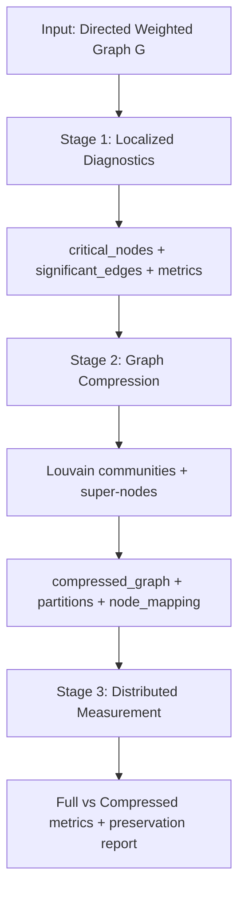

# Module 5 Protocol Simulation: Algorithmic Design

Source notebook: `[Base]Module5_Protocol_Simulation.ipynb`  
Author (notebook): Derick F. Tangap — CAS 521: Network Analysis

---

## Core Design Philosophy

The notebook implements a three-stage, localized-first pipeline for analyzing complex networks (CAS 521 Module 5). The design principle is:

1. Diagnose locally — find which nodes and edges matter.
2. Compress intelligently — shrink the graph while preserving those elements.
3. Measure globally — evaluate system-level properties on full vs. compressed graphs.

Everything flows through one entry point: `execute_m5_protocol(G, preserve_top_k=0.10, compression_method='louvain', seed=42)`.



---

## Layer 0: Data Preparation

Before the protocol runs, graphs are normalized:

| Function | Role |
|---|---|
| `load_snap_graph` | SNAP edge lists → `nx.DiGraph` |
| `load_facebook_graph` | Facebook ego nets → bidirectional directed graph |
| `assign_edge_weights` | Adds random weights [0.1, 1.0] when datasets are unweighted |
| `sample_large_graph` | Subsamples huge graphs (e.g. roadNet-CA) for tractability |

Contract: All downstream stages expect a directed, weighted graph.

---

## Stage 1: Localized Diagnostics (`execute_stage1`)

Question answered: *Which nodes and edges really matter for coordination?*

### Step 1 — Compute four independent node metrics

These are logically parallel (no cross-dependencies) but run sequentially in the notebook:

| Metric | Function | Meaning |
|---|---|---|
| Weighted degree | `compute_weighted_degree` | Sum of in+out edge weights — connectivity strength |
| Betweenness | `compute_betweenness_centrality` | Shortest-path bottlenecks |
| Eigenvector | `compute_eigenvector_centrality` | Importance via important neighbors |
| Transitivity | `compute_transitivity` | Local clustering (undirected conversion) |

### Step 2 — Derive preservation sets

Critical nodes — top `top_k_nodes` (default 10%) ranked by betweenness via `identify_critical_nodes`.

Significant edges — top `top_k_edges` (default 5%) by LCC impact via `compute_link_weight_significance`:

- Baseline = size of largest weakly connected component (LCC).
- For each edge: remove it, recompute LCC, score = `(baseline − new_LCC) / baseline`.
- On large graphs: sample at most 1000 edges for speed.

Output contract:
```python
{
  'localized_metrics': { weighted_degree, betweenness, eigenvector, transitivity },
  'critical_nodes': [...],
  'significant_edges': [(u,v), ...],
  'computation_time': {...}
}
```

---

## Stage 2: Graph Compression (`execute_stage2`)

Question answered: *Can we shrink the graph without losing coordination structure?*

### Algorithm (`compress_graph`)

1. Mark critical nodes/edges with `preserve=True` attributes (`preserve_critical_elements`).
2. Partition with Louvain on the undirected version (`detect_communities_louvain`).
3. Build super-nodes:   - Each community → one `super_N` node.
   - Exception: a community with exactly one node that is critical stays as the original node.
   - All critical nodes are also kept as individual nodes (connectors).
4. Aggregate edges: map original edges to super-node pairs; sum weights; skip self-loops within a super-node.
5. Force-preserve significant edges if aggregation would drop them.

Compression ratio = `original_nodes / compressed_nodes`.

Example from the notebook run: 500 nodes → 65 super-nodes (7.69× compression).

---

## Stage 3: Distributed Measurement (`execute_stage3`)

Question answered: *How resilient and well-connected is the system as a whole?*

Computes on both full and compressed graphs:

| Metric | Function | Interpretation |
|---|---|---|
| Global efficiency | `compute_global_efficiency` | Average inverse shortest-path distance |
| Avg path length | `compute_avg_path_length` | Typical hop distance (weighted) |
| Modularity | `compute_modularity` | Community structure strength |
| LCC fraction | `compute_lcc_size` | Fraction of nodes in largest component |

Then `compare_metrics_full_vs_compressed` reports preservation % for each metric (how faithfully compression retained global behavior).

Note: `run_percolation_test` exists but is not called inside `execute_stage3` — it is used separately in Experiment 4.

---

## Main Orchestrator Wiring

```python
execute_m5_protocol(G, preserve_top_k=0.10):
    stage1 = execute_stage1(G, top_k_nodes=0.10, top_k_edges=0.05)  # edges = half of nodes
    stage2 = execute_stage2(G, stage1, method='louvain')
    stage3 = execute_stage3(G, G_compressed=stage2['compressed_graph'], partitions=stage2['partitions'])
    return { stage1, stage2, stage3, total_computation_time, protocol_config }
```

The edge preservation rate is always half the node preservation rate — a fixed design choice baked into the orchestrator.

---

## Percolation (Separate Resilience Module)

`run_percolation_test` simulates progressive node removal:

- Random removal — failure robustness.
- Targeted removal — attack on high-betweenness nodes (precomputed once, then applied to remaining nodes).

At each step (default: 5% increments up to 50% removal), it tracks LCC fraction and global efficiency. Used in Experiment 4, not the main 3-stage pipeline.

---

## Experimental Validation Design

The notebook validates the protocol through four experiments:

| Experiment | Purpose |
|---|---|
| 1 — Baseline | End-to-end run on cit-HepPh or synthetic Barabási–Albert (500 nodes) |
| 2 — Preservation | Stage 2 with vs without critical elements; measures path-length distortion |
| 3 — Scaling | Runtime and compression ratio at 100, 300, 500, 1000 nodes |
| 4 — Resilience | Random vs targeted percolation curves |

Experiment 2 is the key algorithmic validation: without preservation, compression is more aggressive (25× vs 7×) but path-length distortion is much worse (140% vs 53%).

---

## Design Patterns and Trade-offs

### Strengths

- Clear pipeline contract — each stage consumes the previous stage's dict output.
- Preservation-aware compression — not blind Louvain collapse; Stage 1 directly feeds Stage 2.
- Scalability hooks — edge sampling, graph sampling, timing instrumentation.
- Reproducibility — `seed=42` everywhere.

### Algorithmic simplifications / caveats

- Link significance uses sampled edges (max 1000), so significant-edge sets are approximate on large graphs.
- Louvain runs on undirected conversion; direction is partially lost in community structure.
- Critical nodes inside multi-node communities have asymmetric handling in `compress_graph` (some mapping edge cases).
- `global_efficiency` returned 0.0 in the notebook's directed-graph runs — likely a NetworkX behavior on directed graphs rather than a true zero-efficiency network.
- Percolation is orthogonal to the main protocol — resilience is analyzed separately, not as Stage 4.

---

## Mental Model (One Sentence)

The protocol is a "diagnose → preserve → compress → validate" loop: identify bottlenecks and bridge edges locally, collapse communities into super-nodes while keeping those elements, then check whether global network properties (efficiency, path length, modularity, connectivity) survive compression.

---

## Key Functions Reference

| Block | Orchestrator | Supporting functions |
|---|---|---|
| Data loading | — | `load_snap_graph`, `load_facebook_graph`, `assign_edge_weights`, `sample_large_graph` |
| Stage 1 | `execute_stage1` | `compute_weighted_degree`, `compute_betweenness_centrality`, `compute_eigenvector_centrality`, `compute_transitivity`, `identify_critical_nodes`, `compute_link_weight_significance` |
| Stage 2 | `execute_stage2` | `preserve_critical_elements`, `detect_communities_louvain`, `compress_graph` |
| Stage 3 | `execute_stage3` | `compute_global_efficiency`, `compute_avg_path_length`, `compute_modularity`, `compute_lcc_size`, `compare_metrics_full_vs_compressed` |
| Resilience | — | `run_percolation_test` |
| Main pipeline | `execute_m5_protocol` | — |
| Visualization | — | `plot_metrics_comparison`, `plot_percolation_curves` |

---

## Datasets Referenced in Notebook

- cit-HepPh — Citation network (34,546 nodes, 421,578 edges)
- Facebook Ego Networks — Social networks
- roadNet-CA — California road network (sampled for large-scale testing)

Synthetic fallback: Barabási–Albert scale-free graphs when dataset files are unavailable.
